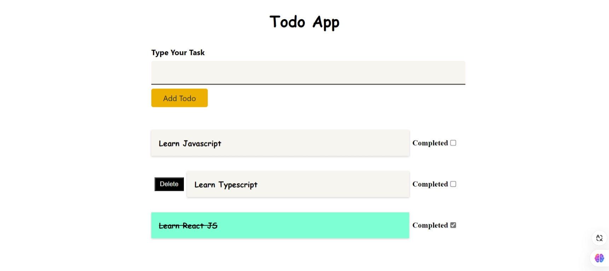

# Task App

A simple task management app built with **React**, **TypeScript**, and **CSS Modules**. Users can add, delete, and mark tasks as completed.

## Features

- **Add Tasks**: Users can add new tasks to the list.
- **Delete Tasks**: Users can remove tasks from the list.
- **Mark Tasks as Completed**: Users can mark tasks as completed.
- **Responsive Design**: The app is designed to work on all screen sizes.

## Technologies Used

- **React**: A JavaScript library for building user interfaces.
- **TypeScript**: A typed superset of JavaScript that compiles to plain JavaScript.
- **CSS Modules**: For scoped and modular CSS styling.
- **Local Storage**: Tasks are saved in the browser's local storage for persistence.


## Screenshots



## Installation

Follow these steps to set up the project locally:

1. **Clone the repository**:
   ```bash
   git clone https://github.com/AbdelhaliemAdham/task-app.git

2. **install dependencies**:
    ```bash
    npm install
3. **start development server**:
   ```bash
   npm start
4. **open localhost**:
   ```bash
   http://localhost:3000


## Developer Info

- **Gmail** : abdelhaliemadham@gmail.com || abdo09adham@gmail.com.
- **phone** : 01008782736 || 01142828110.
- **LinkedIn** : https://www.linkedin.com/in/abdelhaliem-adham-4485ab20b/.
